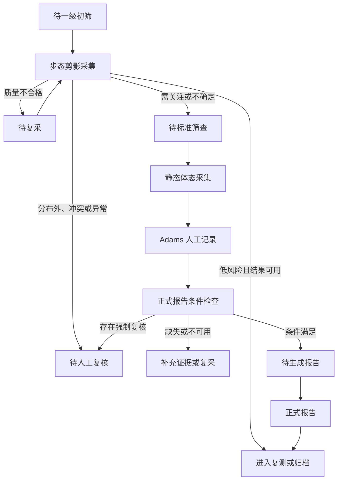

# SPEC：RehabScreenLab 移动端早筛闭环 V3.0

## 0. 文档状态

- 文档类型：产品、交互与前端开发联合规格。
- 版本：V3.0。
- 状态：目标版本，待实现。
- 适用端：移动 Web 与 Capacitor Android。
- 权威范围：移动端信息架构、页面行为、证据门控、文案边界和验收标准。
- 视觉母版：`../ui-design/high-fidelity-v3/screens/04-standard-screening-hub.png`。
- 六张目标界面：`../ui-design/high-fidelity-v3/screens/`。
- 历史版本：`archive/2026-07-29-v2-baseline/`。

本规格描述目标行为，不代表当前代码已经具备相应能力。当前前端仍以既有 `Dashboard / Subject / Session / Protocol / Report` 结构为主，实施时按第 15 节迁移。

## 1. 产品定位与边界

RehabScreenLab 是青少年姿态与脊柱风险筛查闭环工具，用于：

- 批量对象进入与任务分配；
- 步态剪影初步分流；
- 静态体态和 Adams 人工观察证据采集；
- 采集质控、复采、人工复核和正式报告门控；
- 报告归档与复测跟踪。

产品不用于：

- 医学诊断；
- Cobb 角估算；
- 用手机画面自动计算 ATR；
- 用二维 Adams 画面自动输出胸段或腰段严重度；
- 代替 X 光、专科检查或专业人员判断；
- 根据深蹲单项结果升级脊柱风险。

### 1.1 协议角色

| 协议 | 角色 | 默认要求 |
| --- | --- | --- |
| `gait_silhouette` | 一级初筛与分流 | 一级必需 |
| `static_posture` | 二级标准筛查证据 | 二级必需 |
| `adams_forward_bend` | 二级人工观察证据 | 二级必需 |
| `squat` | 功能动作补充证据 | 可选 |

### 1.2 核心原则

1. 先判断采集是否可用，再判断风险。
2. 不确定结果进入明确工作流，不强制给出结论。
3. 缺失证据不得按“正常”处理。
4. 初筛结果不能单独生成正式筛查报告。
5. 每个阻塞状态必须向用户提供一个明确的下一步动作。

## 2. 用户与权限

### 2.1 现场筛查人员

可执行建档、剪影采集、静态体态采集和任务流转。只有完成培训并具有对应权限的人员可以提交 Adams 人工观察。

### 2.2 专业复核人员

可查看结构化证据、处理冲突、退回复采、完成强制复核和批准正式报告。

### 2.3 组织管理员

可管理批次、人员权限、培训状态、设备配置、数据保留策略和审计日志。

### 2.4 权限规则

- 未取得相机权限时不得进入采集状态。
- 未获得必要知情同意时不得创建采集任务。
- 无 Adams 资质的账号可以查看记录，不得新增、修改或提交观察。
- 正式报告生成与批准权限分离时，生成者不得绕过复核状态。

## 3. 主流程与状态机



### 3.1 工作流状态

```ts
type ScreeningStatus =
  | "pending_initial_screening"
  | "initial_screening_in_progress"
  | "pending_standard_screening"
  | "pending_recapture"
  | "pending_review"
  | "pending_report"
  | "pending_retest"
  | "archived";
```

### 3.2 状态与主要动作

| 状态 | 页面首要动作 |
| --- | --- |
| `pending_initial_screening` | 开始步态采集 |
| `initial_screening_in_progress` | 继续采集 |
| `pending_standard_screening` | 进入标准筛查 |
| `pending_recapture` | 按原因重新采集 |
| `pending_review` | 查看或提交人工复核 |
| `pending_report` | 生成正式报告 |
| `pending_retest` | 安排复测 |
| `archived` | 查看归档 |

## 4. 正式报告门控

```ts
type FormalReportConditions = {
  standard_screening_triggered: boolean;
  initial_triage_usable_or_overridden: boolean;
  static_posture_usable: boolean;
  adams_usable: boolean;
  mandatory_review_completed: boolean;
  unresolved_conflicts: string[];
  recapture_protocols: ProtocolType[];
  blocking_reasons: string[];
  ready: boolean;
};
```

`ready = true` 必须同时满足：

- 二级标准筛查已被触发；
- 一级剪影结果可用，或已记录不可用原因、人工升级依据和责任人；
- 静态体态证据可用；
- Adams 人工观察已由有权限人员提交且可用；
- 所有强制人工复核已经完成；
- 不存在未处理的证据冲突；
- 必需协议均不处于待复采状态。

深蹲不参与 `ready` 计算，不完成深蹲不能阻止正式报告。

## 5. 信息架构与路由

### 5.1 底部导航

底部导航固定为五项，每个页面只允许一个选中项：

| 导航 | 目标路由 | 职责 |
| --- | --- | --- |
| 任务 | `/tasks` | 待处理队列与下一步动作 |
| 学生 | `/students` | 学生列表、建档和处理中心 |
| 采集 | `/capture` | 当前任务的协议采集入口 |
| 报告 | `/reports` | 报告条件、报告与归档 |
| 我的 | `/profile` | 账号、培训资质、设备与设置 |

### 5.2 六个核心页面

| ID | 页面 | 目标路由 | 导航选中 |
| --- | --- | --- | --- |
| UI-01 | 早筛任务 | `/tasks` | 任务 |
| UI-02 | 步态剪影采集 | `/sessions/:id/capture/gait-silhouette` | 采集 |
| UI-03 | 初筛结果 | `/sessions/:id/triage-result` | 报告 |
| UI-04 | 标准筛查 | `/sessions/:id/standard-screening` | 采集 |
| UI-05 | Adams 前屈记录 | `/sessions/:id/capture/adams` | 采集 |
| UI-06 | 正式报告条件 | `/sessions/:id/report-readiness` | 报告 |

### 5.3 返回规则

- 采集页返回时，如果尚未开始采集，直接返回来源页。
- 采集中返回时必须弹出确认：“退出后本次未完成采集不会保存”。
- 表单有未提交修改时必须提示保存或放弃。
- 已完成结果页返回不清除结果。
- 从通知或深链进入时，返回目标为该学生处理中心，而不是空浏览历史。

## 6. 视觉与布局规范

视觉规范以 V3 母版为准，代码 Token 以本节为目标基线。

### 6.1 颜色

| Token | 值 | 用途 |
| --- | --- | --- |
| `color.background` | `#FAF9F6` | 暖象牙白页面背景 |
| `color.surface` | `#FFFFFF` | 主卡片 |
| `color.primary` | `#006B5F` | 标题、选中态、主按钮 |
| `color.primaryDark` | `#00423B` | 强调文字与按钮深色端 |
| `color.sageSurface` | `#F1F6F2` | 完成、说明和弱提示背景 |
| `color.sageBorder` | `#BBCAC6` | 绿色弱边框 |
| `color.amber` | `#855300` | 待完成、缺失、需关注 |
| `color.amberSurface` | `#FFF4E3` | 提醒面板背景 |
| `color.textPrimary` | `#1A1C1A` | 正文主文字 |
| `color.textSecondary` | `#5F6361` | 次要文字 |
| `color.error` | `#BA1A1A` | 技术失败或不可恢复错误 |

风险提醒默认使用琥珀色。红色只用于明确的系统失败、数据损坏或安全风险，不用于制造疾病恐慌。

### 6.2 尺寸

- 页面内容水平边距：`20px`。
- 卡片间距：`16px`。
- 大区块间距：`24px`。
- 卡片圆角：`20px`。
- 信息面板圆角：`16px`。
- 主按钮最小高度：`56px`。
- 触摸目标：不小于 `44 × 44px`。
- 底部导航高度：含安全区不小于 `76px`。
- 内容底部预留：底部导航高度加 `16px`。

### 6.3 字体层级

- 页面标题：`24px / 32px / 700`。
- 卡片标题：`18px / 26px / 700`。
- 正文：`16px / 24px / 400`。
- 辅助文字：`14px / 20px / 400`。
- 标签：`14px / 20px / 600`。
- 数字主指标：`40px / 48px / 700`。

中文字体使用系统无衬线字体栈；数字和英文可沿用 Manrope。不得因字体加载失败造成中文回退为乱码。

### 6.4 一致性规则

- 相同状态必须使用相同颜色、图标和文案。
- 图标统一为细线风格；不得混用照片、3D 图标和不同笔画图标。
- 页面只允许一个主按钮。
- 页面只允许一个底部导航选中态。
- 卡片整体可点击时，不再在卡片内放置多个竞争性点击区域。

## 7. 共享组件契约

### 7.1 `MobilePageHeader`

属性：

```ts
type MobilePageHeaderProps = {
  title: string;
  back?: { label: string; to?: string };
  trailing?: ReactNode;
};
```

要求：

- 标题视觉居中，不受左右按钮宽度影响；
- 返回按钮具有明确 `aria-label`；
- 一级页面可无返回按钮。

### 7.2 `StatusBadge`

```ts
type StatusBadgeTone =
  | "success"
  | "attention"
  | "optional"
  | "neutral"
  | "error";
```

固定文案优先使用：`已完成`、`待完成`、`可选`、`可用`、`缺失`、`需复核`、`合格`。

### 7.3 `EvidenceCard`

必须包含：

- 协议图标；
- 协议名称；
- 一行状态说明；
- 一个状态标签；
- 必要时显示阻塞边框；
- 点击后只进入该协议的唯一下一步。

### 7.4 `NoticePanel`

类型：

- `information`：产品说明和隐私说明；
- `attention`：需要行动但非技术错误；
- `error`：权限、网络、保存或数据问题。

注意面板必须给出“发生了什么”和“下一步怎么做”，不得只显示错误代码。

### 7.5 `PrimaryAction`

- 同一页面只显示一个主操作；
- 进行异步提交时锁定重复点击并显示进行中状态；
- 禁用状态必须附带可见原因；
- 网络失败后保留用户已填写数据并允许重试。

### 7.6 `SegmentedChoice`

- 用于 Adams 三选一字段；
- 选项必须互斥；
- 选中态不能仅靠颜色表达；
- 键盘与读屏顺序与视觉顺序一致。

### 7.7 `BottomNavBar`

固定标签：`任务 / 学生 / 采集 / 报告 / 我的`。路由改变后由路由配置决定选中态，不允许页面局部状态手工点亮第二项。

## 8. 六个核心页面规格

## 8.1 UI-01 早筛任务

参考图：`../ui-design/high-fidelity-v3/screens/01-screening-tasks.png`

### 页面目标

让现场人员在进入页面后立即知道今天完成了多少任务、下一名对象需要做什么，以及阻塞原因。

### 进入条件

- 用户已登录；
- 已选择组织或筛查批次；
- 用户具有任务查看权限。

### 数据需求

```ts
type ScreeningTaskCard = {
  task_id: string;
  subject_id: string;
  subject_display_name: string;
  status: ScreeningStatus;
  next_action: NextAction;
  protocol?: ProtocolType;
  due_at?: string;
  blocking_reason?: string;
};
```

### 展示规则

- 顶部展示今日完成数与总任务数；
- 默认排序：需要复采 > 待复核 > 待标准筛查 > 待一级初筛 > 待报告；
- 同优先级按到期时间升序；
- 每张卡片只提供一个主要动作；
- “筛查不是诊断”说明在首次使用、版本更新或用户主动查看时展示，不能遮挡任务。

### 交互

- 点击“开始步态采集”进入 UI-02；
- 点击已完成协议进入对应证据详情；
- 点击待标准筛查进入 UI-04；
- 下拉刷新任务，保留当前滚动位置。

### 状态

- `loading`：显示三张结构一致的骨架卡；
- `empty`：显示“当前没有待处理任务”及“查看学生”；
- `offline`：显示本地缓存任务和离线标识；
- `error`：显示重试，不清空旧数据；
- `partial`：单卡数据失败时只禁用该卡，不阻塞整个页面。

### 埋点

- `task_list_viewed`
- `task_primary_action_clicked`
- `task_list_refreshed`
- `task_blocker_viewed`

### 验收

- 用户无需进入学生详情即可识别下一步；
- 页面中不存在两个底部导航选中项；
- 无任务、离线和接口失败都有明确动作；
- 不出现“AI 诊断”或疾病概率。

## 8.2 UI-02 步态剪影采集

参考图：`../ui-design/high-fidelity-v3/screens/02-gait-silhouette-capture.png`

### 页面目标

采集可用于初步分流的短时步态剪影，并在分析前完成质量门控。

### 进入条件

- 已选定学生和会话；
- 已获得知情同意；
- 相机权限可用；
- 设备满足最低能力要求。

### 采集引导

- 手机固定在身体侧前方；
- 自然步行约 `6—8 米`；
- 全身持续入镜；
- 画面光线充足；
- 默认仅保留剪影、结构化特征和质控信息。

距离是现场布置建议，不作为从二维图像推断真实尺度的依据。

### 采集状态

```ts
type GaitCaptureState =
  | "permission_required"
  | "device_unavailable"
  | "positioning"
  | "ready"
  | "countdown"
  | "capturing"
  | "processing"
  | "quality_failed"
  | "upload_failed"
  | "completed";
```

### 实时质量指标

- `full_body_visible`
- `lighting_acceptable`
- `camera_stable`
- `occlusion_acceptable`
- `valid_frame_ratio`
- `direction_consistent`

所有必需指标合格前，“开始采集”可以进入录制，但“提交分析”必须禁用。质量失败必须显示具体原因，例如“脚部持续离开画面”，不能只显示“采集失败”。

### 结果分支

- 质量合格：提交并进入 UI-03；
- 质量不合格：进入复采状态，保留失败原因；
- 模型不可用或分布外：转 `pending_review`；
- 上传失败：保留本地加密缓存并允许重试或稍后上传。

### 隐私

- 原始 RGB 默认不进入报告；
- 原始视频默认不长期保存；
- 若机构策略要求保存，采集前必须展示用途、保留时间和撤回方式。

### 埋点

- `gait_capture_opened`
- `camera_permission_requested`
- `gait_capture_started`
- `gait_quality_failed`
- `gait_capture_submitted`
- `gait_upload_retried`

### 验收

- 未取得权限时不会出现黑屏式死路；
- 质量不合格数据不能生成风险分流结果；
- 页面不展示骨骼点、Cobb 角或 ATR；
- 用户能明确知道如何修正每个质量问题。

## 8.3 UI-03 初筛结果

参考图：`../ui-design/high-fidelity-v3/screens/03-initial-triage-result.png`

### 页面目标

展示初步分流结果、采集质量和唯一下一步，同时明确它不是正式报告。

### 输出类型

```ts
type TriageOutcome =
  | "low"
  | "attention"
  | "recapture_needed"
  | "review_required";
```

### 文案映射

| 输出 | 标题 | 主要动作 |
| --- | --- | --- |
| `low` | 本次初筛未见明显风险信号 | 安排复测或完成任务 |
| `attention` | 建议进一步筛查 | 进入标准筛查 |
| `recapture_needed` | 采集质量不足 | 重新采集 |
| `review_required` | 需要人工复核 | 提交人工复核 |

### 展示规则

- 展示方向性观察时必须同时展示方向与置信度；
- 不显示未经校准的患病概率；
- 不把模型特征名称直接当作医学结论；
- 结果说明固定包含：“该结果仅用于初步分流，不能代替临床诊断。”

### 交互

- `attention` 点击主按钮进入 UI-04；
- `recapture_needed` 返回 UI-02，并携带失败原因；
- `review_required` 创建复核任务并进入学生处理中心；
- `low` 根据组织策略进入复测安排或归档确认。

### 埋点

- `triage_result_viewed`
- `triage_next_action_clicked`
- `triage_explanation_opened`

### 验收

- 每种结果均只有一个首要下一步；
- `attention` 不使用确诊、阳性或患病措辞；
- 初筛页面不能导出正式报告；
- 采集质量与风险结果分开展示。

## 8.4 UI-04 标准筛查

参考图：`../ui-design/high-fidelity-v3/screens/04-standard-screening-hub.png`

### 页面目标

作为学生二级筛查处理中心，展示必需证据、可选证据和当前阻塞项。

### 协议卡规则

| 协议 | 必需性 | 完成条件 |
| --- | --- | --- |
| 静态体态 | 必需 | 正面、侧面、背面记录均可用 |
| Adams 人工记录 | 必需 | 有权限人员提交完整结构化记录 |
| 深蹲动作 | 可选 | 用户主动选择并完成，不影响报告门控 |

### 卡片状态

`未开始 / 采集中 / 已完成 / 待复采 / 待复核 / 可选`

- 必需协议待完成：琥珀色；
- 可选协议未开始：灰绿色；
- 待复采必须替换“待完成”为具体阻塞动作；
- 已完成卡片点击进入证据详情，而不是重新采集。

### 交互

- 默认主按钮指向优先级最高的缺失必需证据；
- Adams 缺失时显示“记录 Adams 观察”；
- 静态体态缺失时显示“采集静态体态”；
- 两项均完成时显示“检查正式报告条件”；
- 深蹲入口不得占用主按钮。

### 埋点

- `standard_screening_viewed`
- `required_protocol_opened`
- `optional_squat_opened`
- `report_readiness_requested`

### 验收

- 用户能在五秒内区分必需与可选项目；
- 未完成深蹲不产生警告或阻塞；
- 页面主按钮始终指向当前最高优先级动作；
- 已完成证据不会因刷新变回未开始。

## 8.5 UI-05 Adams 前屈记录

参考图：`../ui-design/high-fidelity-v3/screens/05-adams-manual-record.png`

### 页面目标

让受训观察者结构化记录可见体征，而不是让手机自动推断 Adams 严重度。

### 权限与审计

提交前必须记录：

- `observer_id`
- `observer_training_status`
- `observed_at`
- `device_id`
- `session_id`
- `record_version`

无有效培训状态时，页面只读并显示“当前账号无 Adams 记录权限”。

### 表单字段

```ts
type ObservationGrade = "none" | "mild" | "obvious";
type SuspectedSide = "left" | "uncertain" | "right";

type AdamsManualRecord = {
  thoracic_observation: ObservationGrade;
  lumbar_observation: ObservationGrade;
  suspected_side: SuspectedSide;
  atr_degrees?: number;
  atr_source?: "validated_device" | "manual_entry";
  notes?: string;
};
```

规则：

- 胸段观察必填；
- 腰段观察必填；
- 疑似侧别必填，允许“不确定”；
- ATR 可选；
- ATR 只接受经过验证的设备结果或人工录入；
- ATR 合法范围由受验证的设备协议配置提供，前端不得自行猜测临床阈值；
- 录入 ATR 时必须记录来源；
- 页面固定显示“手机不自动计算 ATR”。

### 提交

- 提交前显示字段级校验；
- 提交中禁止重复操作；
- 保存成功后进入 UI-06；
- 保存失败时保留全部本地表单内容；
- 修改已提交记录必须创建新版本并保留原版本审计信息。

### 冲突处理

出现以下任一情况时进入 `pending_review`：

- 人工观察明显异常；
- 胸段和腰段记录与其他证据方向冲突；
- ATR 来源不明；
- 操作者权限或培训状态失效；
- 记录在提交后被修改。

进入复核不等于阻止保存，系统应先保存记录，再创建复核任务。

### 埋点

- `adams_record_opened`
- `adams_field_changed`
- `atr_entered`
- `adams_record_submitted`
- `adams_record_submit_failed`
- `adams_record_revised`

### 验收

- 页面没有自动测量动画、角度扫描线或 AI 严重度；
- 未填写必需字段不能提交；
- “不确定”是合法选项，不会被默认改成左或右；
- 网络失败后用户输入不丢失；
- 提交人、时间、版本和 ATR 来源可追溯。

## 8.6 UI-06 正式报告条件

参考图：`../ui-design/high-fidelity-v3/screens/06-formal-report-readiness.png`

### 页面目标

解释正式报告是否可生成、缺少什么证据，以及下一步应该做什么。

### 进度计算

界面主进度 `2 / 3` 只表示三类核心证据的完成情况：

1. 剪影证据；
2. 静态体态；
3. Adams 人工记录。

该进度不是风险分数。强制复核和冲突状态另以阻塞原因显示。

### 状态优先级

1. 必需证据待复采；
2. 必需证据缺失；
3. 未处理冲突；
4. 强制复核未完成；
5. 条件满足。

### 主按钮映射

| 阻塞原因 | 主按钮 |
| --- | --- |
| 剪影不可用 | 重新采集剪影 |
| 静态体态缺失或不可用 | 补充静态体态 |
| Adams 缺失 | 补充 Adams 记录 |
| 存在冲突 | 查看冲突证据 |
| 待强制复核 | 进入人工复核 |
| 已满足 | 生成正式报告 |

### 文案

条件不满足：

> 暂不可生成正式报告。补齐必要证据并完成要求的复核后即可生成；当前结果仅用于初步分流。

条件满足：

> 正式报告条件已满足。请确认学生信息和证据版本后生成报告。

页面固定显示“深蹲不是必选项”。

### 并发与版本

- 生成报告时提交当前证据版本集合；
- 若证据在生成前被他人更新，返回版本冲突并刷新条件；
- 不允许使用已被撤回或标记不可用的证据生成报告。

### 埋点

- `report_readiness_viewed`
- `report_blocker_clicked`
- `formal_report_generation_started`
- `formal_report_generation_blocked`
- `formal_report_generated`

### 验收

- 缺少必需证据时生成按钮不可用或被替换为补充动作；
- `2 / 3` 不被标记为风险评分；
- 深蹲未完成不影响 `ready`；
- 证据版本变化后不会生成过期报告；
- 所有阻塞原因都能跳转到对应处理页面。

## 9. 必须补齐的辅助页面与状态

六张高保真图覆盖核心路径，但开发交付还必须包含：

| ID | 页面或状态 | 最低要求 |
| --- | --- | --- |
| SUP-01 | 学生选择与建档 | 查重、必填校验、监护人同意状态 |
| SUP-02 | 隐私与知情同意 | 用途、保存内容、保留时间、撤回方式 |
| SUP-03 | 相机权限 | 首次授权、拒绝、永久拒绝、系统设置入口 |
| SUP-04 | 采集质量失败 | 逐项原因、修正示意、重新采集 |
| SUP-05 | 静态体态采集 | 正面、侧面、背面三视图与质量门槛 |
| SUP-06 | 离线与上传失败 | 本地加密保存、重试、冲突提示 |
| SUP-07 | 人工复核 | 证据对照、退回复采、通过、审计记录 |
| SUP-08 | 正式报告详情 | 条件、质量、风险、证据、冲突、下一步、免责声明 |
| SUP-09 | 报告导出 | 身份确认、脱敏选项、导出日志 |
| SUP-10 | 复测安排 | 时间、责任人、提醒和历史对比 |

这些状态可以先使用线框和组件复用实现，不要求在核心闭环前全部制作独立高保真图，但不得省略业务行为。

## 10. 前端视图模型

```ts
type ProtocolType =
  | "gait_silhouette"
  | "static_posture"
  | "adams_forward_bend"
  | "squat";

type ProtocolUiStatus =
  | "not_started"
  | "capturing"
  | "processing"
  | "usable"
  | "needs_recapture"
  | "needs_review"
  | "optional";

type ProtocolEvidenceSummary = {
  protocol: ProtocolType;
  ui_status: ProtocolUiStatus;
  required: boolean;
  updated_at?: string;
  operator_name?: string;
  blocking_reasons: string[];
  version?: string;
};

type NextAction =
  | "start_initial_screening"
  | "continue_capture"
  | "start_standard_screening"
  | "capture_static_posture"
  | "record_adams_observation"
  | "recapture"
  | "send_to_review"
  | "resolve_conflict"
  | "generate_formal_report"
  | "schedule_retest"
  | "archive";
```

前端不得仅根据“协议存在”判断完成，必须使用后端返回的 `usable`、`blocking_reasons` 和版本信息。

## 11. 数据保存与失败恢复

- 表单草稿按 `session_id + protocol + operator_id` 隔离；
- 敏感草稿必须加密保存；
- 成功提交后清除对应草稿；
- 上传支持幂等键，重复点击不得创建重复证据；
- 客户端显示时间使用本地时区，服务端保存 UTC；
- 页面恢复时校验证据版本，发现冲突时禁止静默覆盖；
- 所有复采、复核、修改、报告生成和导出操作写入审计日志。

## 12. 文案规范

允许：

- “建议进一步筛查。”
- “需要人工复核。”
- “采集质量不足，请重新采集。”
- “当前结果仅用于初步分流。”
- “建议由专业人员进一步评估。”

禁止：

- “AI 诊断为脊柱侧弯。”
- “患病概率为……”
- “预测 Cobb 角为……”
- “手机自动测得 ATR……”
- “确认存在胸椎或腰椎侧弯。”
- “无需专业检查。”

所有用户可见文案进入 `zh-CN.json`，组件中不得硬编码两套不一致表述。

## 13. 无障碍、性能与隐私

### 13.1 无障碍

- 颜色不是唯一状态信号；
- 状态标签同时提供图标与文字；
- 所有交互元素具有可读名称；
- 动态质量提示通过礼貌级实时区域播报；
- 字体放大至 `200%` 时主操作仍可见；
- 支持减少动态效果设置。

### 13.2 性能

- 任务首屏在正常网络下优先展示缓存骨架和首批任务；
- 采集页延迟加载相机与模型资源；
- 处理阶段显示可解释进度，不伪造百分比；
- 弱网下优先保证证据与表单不丢失。

### 13.3 隐私

- 原始 RGB 默认即时处理后释放；
- 报告只引用结构化证据和必要的脱敏可视材料；
- 导出前确认对象身份和接收范围；
- 设备日志不得包含学生姓名、身份证号或原始画面；
- 数据删除遵循组织策略并保留合规审计记录。

## 14. 测试与验收

### 14.1 必测主路径

1. 任务进入；
2. 相机授权；
3. 合格剪影采集；
4. `attention` 初筛结果；
5. 静态体态完成；
6. Adams 人工记录；
7. 报告条件从 `2 / 3` 变为 `3 / 3`；
8. 正式报告生成；
9. 归档或安排复测。

### 14.2 必测异常路径

- 相机拒绝与永久拒绝；
- 全身未入镜；
- 光线不足；
- 上传中断与重复重试；
- 模型不可用；
- 初筛结果分布外；
- 静态体态缺少一个视图；
- Adams 必填字段缺失；
- ATR 无来源；
- 无 Adams 权限；
- 证据版本冲突；
- 强制复核未完成；
- 报告生成时证据被撤回；
- 离线恢复与草稿恢复。

### 14.3 自动化要求

- 状态机转换单元测试；
- 报告门控组合测试；
- 路由与底部导航单选测试；
- Adams 表单校验测试；
- 采集质量原因映射测试；
- 关键页面无障碍检查；
- 关键主路径端到端测试。

### 14.4 产品验收门槛

- 所有核心页面都具备加载、空、错误和离线处理；
- 所有阻塞状态都有可执行下一步；
- 必需证据缺失时无法生成正式报告；
- 深蹲未完成时仍可在其他条件满足后生成正式报告；
- 手机端不会自动输出 Adams 严重度或 ATR；
- 初筛结果与正式报告在视觉和文案上可明确区分；
- 操作人与证据版本全程可追溯。

## 15. 实施映射

### 15.1 当前与目标导航

| 当前 | 目标 |
| --- | --- |
| `概览 /` | `任务 /tasks` |
| `受试者 /subjects` | `学生 /students` |
| `筛查 /sessions` | `采集 /capture` |
| 无独立报告入口 | `报告 /reports` |
| `设置 /settings` | `我的 /profile` |

### 15.2 推荐前端目录

```text
frontend/src/
├─ features/
│  ├─ tasks/
│  ├─ students/
│  ├─ gait-silhouette/
│  ├─ static-posture/
│  ├─ adams/
│  ├─ standard-screening/
│  ├─ reports/
│  └─ profile/
├─ shared/
│  ├─ components/ui/
│  ├─ config/
│  ├─ layout/
│  ├─ types/
│  └─ i18n/
```

### 15.3 实施顺序

1. 更新领域类型、状态机和报告门控；
2. 迁移五项底部导航和移动端页面壳；
3. 实现任务页与学生处理入口；
4. 实现剪影采集和质量失败闭环；
5. 实现初筛结果分支；
6. 实现标准筛查中心与静态体态；
7. 实现 Adams 权限、表单、审计和版本；
8. 实现报告条件与正式报告；
9. 补齐离线、复核、复测和导出；
10. 完成自动化测试、现场可用性测试和目标人群前瞻验证。

## 16. 发布前检查

- `npm run check`
- `npm run test`
- `npm run build`
- Android 真机权限、相机、返回键和安全区测试；
- 五项导航所有路由只显示一个选中态；
- 核对 V3 六张界面与实现的组件、文案和状态；
- 核对正式报告门控组合；
- 核对原始画面保留策略与组织配置；
- 核对所有禁止性医学文案；
- 完成现场人员任务测试与专业复核人员评审。

## 17. 修订记录

### V3.0

- 将 V3 高保真图转化为开发级页面和组件规格；
- 固定五项移动端导航；
- 明确六个核心页面的进入条件、数据、交互、异常、埋点和验收；
- 将步态剪影限定为初步分流；
- 将 Adams 固定为受训人员人工记录，ATR 仅允许设备或人工录入；
- 将深蹲固定为可选证据；
- 增加正式报告证据、复核、冲突和版本门控；
- 增加离线、权限、隐私、审计和失败恢复要求。
